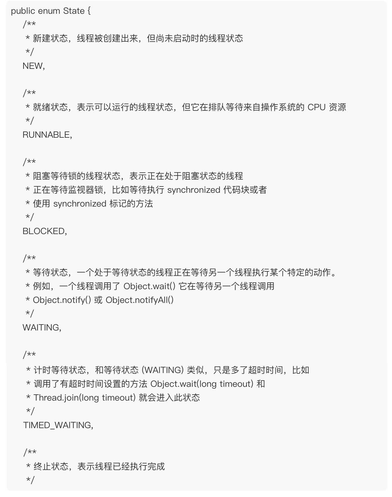
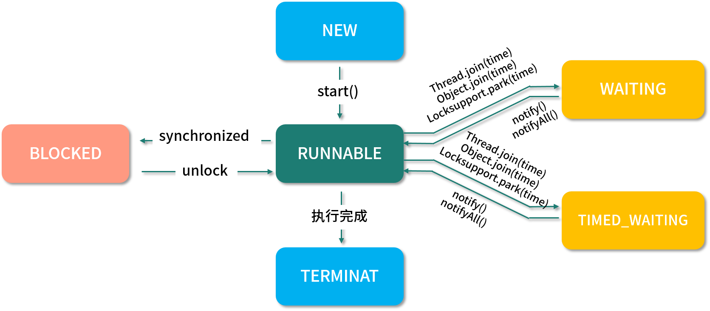
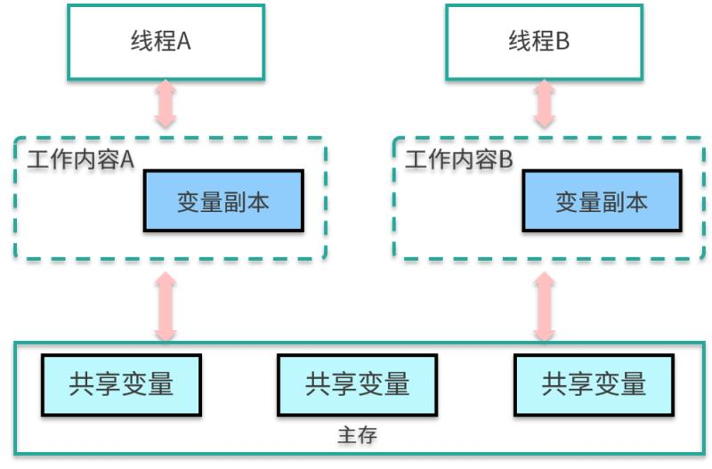

1、数据结构与算法
给定一个无向图 graph，当这个图为二部图时返回 true。

判断一个给定的任意图是否为二部图，就必须要对该图进行一次遍历：
1、深度优先
2、广度优先
二部图，图的所有顶点可以分成两个子集 U 和 V，子集里的顶点互不直接相连，图里面所有的边，一头连着子集 U 里的顶点，一头连着子集 V 里的顶点

提示：如果能将一个图的节点集合分割成两个独立的子集 A 和 B，并使图中的每一条边的两个节点一个来自 A 集合，一个来自 B 集合，就将这个图称为二部图。

1、给图里的顶点涂上颜色，子集 U 里的顶点都涂上红色，子集 V 里的顶点都涂上蓝色。
2、开始遍历这个图的所有顶点，想象一下手里握有红色和蓝色的画笔，每次交替地给遍历当中遇到的顶点涂上颜色
3、如果这个顶点还没有颜色，那就给它涂上颜色，然后换成另外一支画笔。
4、下一个顶点，如果发现这个顶点已经涂上了颜色，而且颜色跟我手里画笔的颜色不同，那么表示这个顶点它既能在子集 U 里，也能在子集 V 里。
5、所以，它不是一个二部图。

2、线程的状态有哪些？它是如何工作的？

典型回答：
线程的状态在 JDK 1.5 之后以枚举的方式被定义在 Thread 的源码中，它总共包含以下 6 个状态：
1、NEW，新建状态，线程被创建出来，但尚未启动时的线程状态；
2、RUNNABLE，就绪状态，表示可以运行的线程状态，它可能正在运行，或者是在排队等待操作系统给它分配 CPU 资源；
3、BLOCKED，阻塞等待锁的线程状态，表示处于阻塞状态的线程正在等待监视器锁，比如等待执行 synchronized 代码块或者使用 synchronized 标记的方法；  
4、WAITING，等待状态，一个处于等待状态的线程正在等待另一个线程执行某个特定的动作，比如，一个线程调用了 Object.wait() 方法，那它就在等待另一个线程调用 Object.notify() 或 Object.notifyAll() 方法；
5、TIMED_WAITING，计时等待状态，和等待状态（WAITING）类似，它只是多了超时时间，比如调用了有超时时间设置的方法 Object.wait(long timeout) 和 Thread.join(long timeout) 等这些方法时，它才会进入此状态；
6、TERMINATED，终止状态，表示线程已经执行完成。

线程的工作模式是，首先先要创建线程并指定线程需要执行的业务方法，然后再调用线程的 start() 方法，此时线程就从 NEW（新建）状态变成了 RUNNABLE（就绪）状态，此时线程会判断要执行的方法中有没有 synchronized 同步代码块，如果有并且其他线程也在使用此锁，那么线程就会变为 BLOCKED（阻塞等待）状态，当其他线程使用完此锁之后，线程会继续执行剩余的方法。

当遇到 Object.wait() 或 Thread.join() 方法时，线程会变为 WAITING（等待状态）状态，如果是带了超时时间的等待方法，那么线程会进入 TIMED_WAITING（计时等待）状态，当有其他线程执行了 notify() 或 notifyAll() 方法之后，线程被唤醒继续执行剩余的业务方法，直到方法执行完成为止，此时整个线程的流程就执行完了，执行流程如下图所示：

考点分析：
线程一般会作为并发编程的起始问题，用于引出更多的关于并发编程的面试问题。
当然对于线程的掌握程度也决定了你对并发编程的掌握程度，通常面试官还会问：
1、BLOCKED（阻塞等待）和 WAITING（等待）有什么区别？
2、start() 方法和 run() 方法有什么区别？
3、线程的优先级有什么用？该如何设置？
4、线程的常用方法有哪些？

3、举例说明什么情况下会更倾向于使用抽象类而不是接口？

回答：
“接口和抽象类都遵循”面向接口而不是实现编码”设计原则，它可以增加代码的灵活性，可以适应不断变化的需求。
下面有几个点可以帮助你回答这个问题：
在 Java 中，你只能继承一个类，但可以实现多个接口。所以一旦你继承了一个类，你就失去了继承其他类的机会了。

接口通常被用来表示附属描述或行为如：Runnable、Clonable、Serializable等等，因此当你使用抽象类来表示行为时，你的类就不能同时是Runnable和Clonable(注：这里的意思是指如果把Runnable等实现为抽象类的情况)，因为在 Java 中你不能继承两个类，但当你使用接口时，你的类就可以同时拥有多个不同的行为。
在一些对时间要求比较高的应用中，倾向于使用抽象类，它会比接口稍快一点。
如果希望把一系列行为都规范在类继承层次内，并且可以更好地在同一个地方进行编码，那么抽象类是一个更好的选择。有时，接口和抽象类可以一起使用，接口中定义函数，而在抽象类中定义默认的实现。

4、 MySQL存储引擎MyISAM与InnoDB区别

存储引擎 Storage engine：MySQL 中的数据、索引以及其他对象是如何存储的，是一套文件系统的实现。

常用的存储引擎有以下：
1、Innodb 引擎：Innodb 引擎提供了对数据库 ACID 事务的支持。并且还提供了行级锁和外键的约束。它的设计的目标就是处理大数据容量的数据库系统。
2、MyIASM 引擎(原本 MySQL 的默认引擎)：不提供事务的支持，也不支持行级锁和外键。
3、MEMORY 引擎：所有的数据都在内存中，数据的处理速度快，但是安全性不高。

那对于 Java 工程师来说，掌握 MySQL 需要到什么程度？ 
1、开发人员对DB的掌握，越深入，你能做的事情就越多。
2、完成业务功能，懂基本的Sql语句。
3、做性能优化，懂索引，懂引擎。
4、做分库分表，懂主从，懂读写分离。
5、做安全，懂权限，懂备份，懂日志。
6、做云数据库，懂源码，懂瓶颈。

5、Java 的内存模型是什么？（JMM 是什么？）

JVM 试图定义一种统一的内存模型，能将各种底层硬件以及操作系统的内存访问差异进行封装，使 Java 程序在不同硬件以及操作系统上都能达到相同的并发效果。它分为工作内存和主内存，线程无法对主存储器直接进行操作，如果一个线程要和另外一个线程通信，那么只能通过主存进行交换，如下图所示。

JVM是底层调优是架构师必备技能之一，工作中会遇到很多项目性能瓶颈，都是要通过底层调优实现的

6、Java常见的垃圾收集器有哪些？

典型回答：
实际上，垃圾收集器（GC，Garbage Collector）是和具体 JVM 实现紧密相关的，不同厂商（IBM、Oracle），不同版本的 JVM，提供的选择也不同。聊聊 5 种最主流的 Oracle JDK

1、Serial GC，它是最古老的垃圾收集器。
“Serial” 体现在其收集工作是单线程的，并且在进行垃圾收集过程中，会进入臭名昭著的 “Stop-The-World” 状态。当然，其单线程设计也意味着精简的 GC 实现，无需维护复杂的数据结构，初始化也简单，所以一直是 Client 模式下 JVM 的默认选项。
从年代的角度，通常将其老年代实现单独称作 Serial Old，它采用了标记 - 整理（Mark-Compact）算法，区别于新生代的复制算法。Serial GC 的对应 JVM 参数是：

、ParNew GC，很明显是个新生代 GC 实现。
它实际是 Serial GC 的多线程版本，最常见的应用场景是配合老年代的 CMS GC 工作，下面是对应参数：

3、CMS（Concurrent Mark Sweep） GC，基于标记 - 清除（Mark-Sweep）算法，设计目标是尽量减少停顿时间，这一点对于 Web 等反应时间敏感的应用非常重要。
一直到今天，仍然有很多系统使用 CMS GC。但是，CMS 采用的标记 - 清除算法，存在着内存碎片化问题，所以难以避免在长时间运行等情况下发生 full GC，导致恶劣的停顿。另外，既然强调了并发（Concurrent），CMS 会占用更多 CPU 资源，并和用户线程争抢。

4、Parallel GC，在早期 JDK 8 等版本中，它是 server 模式 JVM 的默认 GC 选择，也被称作是吞吐量优先的 GC。
它的算法和 Serial GC 比较相似，尽管实现要复杂的多，其特点是新生代和老年代 GC 都是并行进行的，在常见的服务器环境中更加高效。开启选项是：

另外，Parallel GC 引入了开发者友好的配置项，我们可以直接设置暂停时间或吞吐量等目标，JVM 会自动进行适应性调整，例如下面参数：

5、G1 GC 这是一种兼顾吞吐量和停顿时间的 GC 实现，是 Oracle JDK 9 以后的默认 GC 选项。
G1 可以直观的设定停顿时间的目标，相比于 CMS GC，G1 未必能做到 CMS 在最好情况下的延时停顿，但是最差情况要好很多。

G1 GC 仍然存在着年代的概念，但是其内存结构并不是简单的条带式划分，而是类似棋盘的一个个 region。Region 之间是复制算法，但整体上实际可看作是标记 - 整理（Mark-Compact）算法，可以有效地避免内存碎片，尤其是当 Java 堆非常大的时候，G1 的优势更加明显。
G1 吞吐量和停顿表现都非常不错，并且仍然在不断地完善，与此同时 CMS 已经在 JDK 9 中被标记为废弃（deprecated），所以 G1 GC 值得你深入掌握