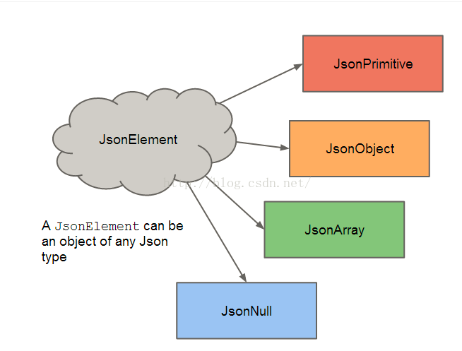
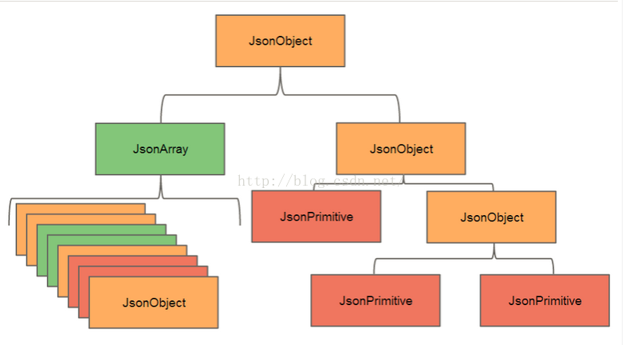

# JSON

## 定义
JSON(JavaScript Object Notation) 是一种轻量级的数据交换格式

## 作用
数据标记，存储，传输

## 特点
1. 读写速度快
2. 解析简单
3. 轻量级
4. 独立于语言，平台
5. 具有自我描叙性

## JSON解析


## 语法
JSON建构于两种结构：

- “名称/值”对的集合（A collection of name/value pairs）。不同的语言中，它被理解为对象（object），纪录（record），结构（struct），字典（dictionary），哈希表（hash table），有键列表（keyed list），或者关联数组 （associative array）。
- 值的有序列表（An ordered list of values）。在大部分语言中，它被理解为数组（array）。

这些都是常见的数据结构。事实上大部分现代计算机语言都以某种形式支持它们。这使得一种数据格式在同样基于这些结构的编程语言之间交换成为可能。

JSON具有以下这些形式：

对象是一个无序的“‘名称/值’对”集合。一个对象以“{”（左括号）开始，“}”（右括号）结束。每个“名称”后跟一个“:”（冒号）；“‘名称/值’ 对”之间使用“,”（逗号）分隔。


```json
	{
      "name": "英语",
      "score": 78.3
    }
```

数组是值（value）的有序集合。一个数组以“[”（左中括号）开始，“]”（右中括号）结束。值之间使用“,”（逗号）分隔。


```json
"courses": [
    {
      "name": "英语",
      "score": 78.3
    }
  ]
```

值（*value*）可以是双引号括起来的字符串（*string*）、数值(number)、`true`、`false`、 `null`、对象（object）或者数组（array）。这些结构可以嵌套。


```json
{
  "url": "https://qqe2.com",
  "name": "欢迎使用JSON在线解析编辑器",
  "array": {
    "JSON校验": "http://jsonlint.qqe2.com/",
    "Cron生成": "http://cron.qqe2.com/",
    "JS加密解密": "http://edit.qqe2.com/"
  },
  "boolean": true,
  "null": null,
  "number": 123,
  "object": {
    "a": "b",
    "c": "d",
    "e": "f"
  }
}
```

字符串（*string*）是由双引号包围的任意数量Unicode字符的集合，使用反斜线转义。一个字符（character）即一个单独的字符串（character string）。

字符串（**string**）与C或者Java的字符串非常相似。


```json
{
  "name": "Zero",
}
```

数值（*number*）也与C或者Java的数值非常相似。除去未曾使用的八进制与十六进制格式。除去一些编码细节。


```json
{
  "age": 28,
}
```

## JSON解析方式

### Android Studio自带org.json解析

- 解析原理：基于文档驱动，需要把全部文件读入到内存中，然后遍历所有数据，根据需要检索想要的数据
- 具体使用

```java
//生成JSON
private void createJson(Context context) throws Exception {
        File file = new File(getFilesDir(), "orgjson.json");//获取到应用在内部的私有文件夹下对应的orgjson.json文件
        JSONObject student = new JSONObject();//实例化一个JSONObject对象
        student.put("name", "OrgJson");//对其添加一个数据
        student.put("sax", "男");
        student.put("age", 23);
        JSONObject course1 = new JSONObject();
        course1.put("name", "语文");
        course1.put("score", 98.2f);
        JSONObject course2 = new JSONObject();
        course2.put("name", "数学");
        course2.put("score", 93.2f);
        JSONArray coures = new JSONArray();//实例化一个JSON数组
        coures.put(0, course1);//将course1添加到JSONArray，下标为0
        coures.put(1, course2);
        //然后将JSONArray添加到名为student的JSONObject
        student.put("courses", coures);
        FileOutputStream fos = new FileOutputStream(file);
        fos.write(student.toString().getBytes());
        fos.close();
        Log.i(TAG, "createJson: " + student.toString());
        Toast.makeText(context, "创建成功", Toast.LENGTH_LONG).show();
    }

//解析JSON
private void parseJson(Context context) throws Exception {
        File file = new File(getFilesDir(), "orgjson.json");
        FileInputStream fis = new FileInputStream(file);
        InputStreamReader isr = new InputStreamReader(fis);
        BufferedReader br = new BufferedReader(isr);
        String line;
        StringBuffer sb = new StringBuffer();

        while (null != (line = br.readLine())) {
            sb.append(line);
        }
        fis.close();
        isr.close();
        br.close();

        Student student = new Student();
        //利用JSONObject进行解析
        JSONObject stuJsonObject = new JSONObject(sb.toString());
        //为什么不用getString?
        //optString会在得不到你想要的值时候返回空字符串""，而getString会抛出异常
        String name = stuJsonObject.optString("name", "");
        student.setName(name);
        student.setSax(stuJsonObject.optString("sax", "男"));
        student.setAge(stuJsonObject.optInt("age", 18));

        //获取数组数据
        JSONArray couresJson = stuJsonObject.optJSONArray("courses");

        for (int i = 0; i < couresJson.length(); i++) {
            JSONObject courseJsonObject = couresJson.getJSONObject(i);
            Course course = new Course();
            course.setName(courseJsonObject.optString("name", ""));
            course.setScore((float) courseJsonObject.optDouble("score", 0));
            student.addCourse(course);
        }

        Log.i(TAG, "parseJson: " + student);
        Toast.makeText(context, "解析成功", Toast.LENGTH_LONG).show();
    }
```

### Gson 解析
- 解析原理：基于事件驱动
- 解析流程：根据所需取的数据 建立1个对应于JSON数据的JavaBean类，即可通过简单操作解析出所需数据
- Gson 不要求JavaBean类里面的属性一定全部和JSON数据里的所有key相同，可以按需取数据
- 具体实现

1. 创建一个与JSON数据对应的JavaBean类（用作存储需要解析的数据）
	- JSON的大括号对应一个对象
		- 对象里面有key,value
		- JavaBean的类属性名 = key
    - JSON的方括号对应一个数组
    	- JavaBean里面对应的也是数组
    	- 对象里 可以有值/对象
    	- 若对象里面只有值，没有key,则说明是纯数组，对应JavaBean里的数组类型
    	- 若对象里面有值和key,则说明是对象数组，对应JavaBean里的内部类     
	- 对象嵌套 
		- 建立内部类 该内部类对象的名字 = 父对象的key ,类似对象数组
		- 
```json
{
  "key": "value",
  "simpleArray": [1,2,3],
  "arrays": [
    [{
      "arrInnerClsKey": "arrInnerClsValue",
      "arrInnerClsKeyNub": 1
    }]
  ],
  "innerclass": {
    "name": "zero",
    "age": 25,
    "sax": "男"
  }
}
```
- 转化成JavaBean

```java
public class GsonBean {

    private String key;
    private InnerclassBean innerclass;
    private List<Integer> simpleArray;
    private List<List<ArraysBean>> arrays;

    public String getKey() {
        return key;
    }

    public void setKey(String key) {
        this.key = key;
    }

    public InnerclassBean getInnerclass() {
        return innerclass;
    }

    public void setInnerclass(InnerclassBean innerclass) {
        this.innerclass = innerclass;
    }

    public List<Integer> getSimpleArray() {
        return simpleArray;
    }

    public void setSimpleArray(List<Integer> simpleArray) {
        this.simpleArray = simpleArray;
    }

    public List<List<ArraysBean>> getArrays() {
        return arrays;
    }

    public void setArrays(List<List<ArraysBean>> arrays) {
        this.arrays = arrays;
    }

    public static class InnerclassBean {
      
        private String name;
        private int age;
        private String sax;

        public String getName() {
            return name;
        }

        public void setName(String name) {
            this.name = name;
        }

        public int getAge() {
            return age;
        }

        public void setAge(int age) {
            this.age = age;
        }

        public String getSax() {
            return sax;
        }

        public void setSax(String sax) {
            this.sax = sax;
        }
    }

    public static class ArraysBean {
      
        private String arrInnerClsKey;
        private int arrInnerClsKeyNub;

        public String getArrInnerClsKey() {
            return arrInnerClsKey;
        }

        public void setArrInnerClsKey(String arrInnerClsKey) {
            this.arrInnerClsKey = arrInnerClsKey;
        }

        public int getArrInnerClsKeyNub() {
            return arrInnerClsKeyNub;
        }

        public void setArrInnerClsKeyNub(int arrInnerClsKeyNub) {
            this.arrInnerClsKeyNub = arrInnerClsKeyNub;
        }
    }
}
```
- 使用例子
- 
```java
public static void main(String... args) throws Exception {
        //TODO:
        Student student = new Student();
        student.setName("Zero");
        student.setSax("男");
        student.setAge(28);
        student.addCourse(new Course("英语", 78.3f));
        Gson gson = new Gson();
        //1. 生成json文件
        File file = new File(CurPath + "/gsonjsontest.json");
        OutputStream oot = new FileOutputStream(file);
        JsonWriter jw = new JsonWriter(new OutputStreamWriter(oot, "utf-8"));
        gson.toJson(student, new TypeToken<Student>() {
        }.getType(), jw);
        jw.flush();
        jw.close();
        //反序列化
        Student student1 = gson.fromJson(new JsonReader(new InputStreamReader(new FileInputStream(file)))
                , new TypeToken<Student>() {
                }.getType());
        System.out.println(student1);
    }
```
### Jackson解析
- 解析原理：基于事件驱动
- 解析过程：
	1. 类似 GSON，先创建1个对应于JSON数据的JavaBean类，再通过简单操作即可解析
	2. 与 Gson解析不同的是：GSON可按需解析，即创建的JavaBean类不一定完全涵盖所要解析的JSON数据，按需创建属性；但Jackson解析对应的JavaBean必须把Json数据里面的所有key都有所对应，即必须把JSON内的数据所有解析出来，无法按需解析

- 导入Jackson依赖
```groovy
//如何配置jackson https://mvnrepository.com/search?q=jackson
    implementation 'com.fasterxml.jackson.core:jackson-databind:2.9.8'
    implementation 'com.fasterxml.jackson.core:jackson-core:2.9.8'
    implementation 'com.fasterxml.jackson.core:jackson-annotations:2.9.8'
```
- 使用Jackson解析
```java
  public static void main(String... args) throws Exception {
        //TODO:
        Student student = new Student();
        student.setName("杰克逊");
        student.setSax("男");
        student.setAge(28);
        student.addCourse(new Course("英语", 78.3f));
        student.addCourse(new Course("语文", 88.9f));
        student.addCourse(new Course("数学", 48.2f));

        ObjectMapper objectMapper = new ObjectMapper();
        //jackson序列化
        File file = new File(CurPath + "/jacksontest.json");
        FileOutputStream fileOutputStream = new FileOutputStream(file);
        objectMapper.writeValue(fileOutputStream, student);


        //反序列化
        Student student1 = objectMapper.readValue(file, Student.class);
        System.out.println(student1);

//        HashMap<String, Student> studentHashMap = new HashMap<>();
//        Student stu1 = new Student("King", "男", 32);
//        stu1.addCourse(new Course("物理", 68.9f));
//        Student stu2 = new Student("Mark", "男", 33);
//        studentHashMap.put("key1", stu1);
//        studentHashMap.put("key2", stu2);
//        System.out.println("studentHashMap:\n" + studentHashMap);
//        JacksonUtil.encode2File(studentHashMap,CurPath + "/jacksontest1.json");
//        String jsonStr = JacksonUtil.encode(studentHashMap);
//        System.out.println(jsonStr);

        //反序列化 TypeReference用法
//        HashMap<String,Student> studentHashMap1 = objectMapper.readValue(jsonStr,HashMap.class);//错误做法
        //正确的方式
//        HashMap<String,Student> studentHashMap1 = objectMapper.readValue(jsonStr, new TypeReference<HashMap<String,Student>>(){});
//        System.out.println("studentHashMap1:\n" + studentHashMap1);


        //List
//        List<Student> studentList = new ArrayList<>();
//        studentList.add(stu1);
//        studentList.add(stu2);
//        JacksonUtil.encode2File(studentList, CurPath + "/jacksontest2.json");
//        String jsonStr2 = JacksonUtil.encode(studentList);
//
//        List<Student> studentList1 = objectMapper.readValue(jsonStr2, objectMapper.getTypeFactory().constructParametricType(ArrayList.class, Student.class));
//        System.out.println("studentList1:\n" + studentList1);

    }
```
### Fastjson解析

- 导入Fastjson依赖
```groovy
implementation 'com.alibaba:fastjson:1.2.57'
```
- 使用Fastjson解析
```java
 public static void main(String ... args) throws Exception {
            //TODO:
        Student student = new Student();
        student.setName("FastJson");
        student.setSax("男");
        student.setAge(28);
        student.addCourse(new Course("英语", 78.3f));
        student.addCourse(new Course("语文", 88.9f));
        student.addCourse(new Course("数学", 48.2f));

        //1. 生成json文件
        File file = new File(CurPath + "/fastjsontest.json");
        FileOutputStream fileOutputStream = new FileOutputStream(file);
        JSONObject.writeJSONString(fileOutputStream,student);

        //2. 反序列化
        Student student1 = JSONObject.parseObject(new FileInputStream(file),Student.class);
        System.out.println(student1);
    }
```

## 自定义一个JSON解析库

编写一个JSON解析器实际上就是一个方法，它的输入是一个表示JSON的字符串，输出是结构化的对应到语言本身的数据结构
一般来说，解析过程包括词法分析和语法分析两个阶段。词法分析阶段的目标是按照构词规则将 JSON 字符串解析成 Token 流，比如有如下的 JSON 字符串：

```json
{
    "key" : "value",
}
```
结果词法分析后，得到一组 Token，如下：
{key : value, }


词法分析解析出 Token 序列后，接下来要进行语法分析。语法分析的目的是根据 JSON 文法检查上面 Token 序列所构成的 JSON 结构是否合法。比如 JSON 文法要求非空 JSON 对象以键值对的形式出现，形如 object = {string : value}。如果传入了一个格式错误的字符串，比如

```json
{
    "key", "value"
}
```
那么在语法分析阶段，语法分析器分析完 Token name后，认为它是一个符合规则的 Token，并且认为它是一个键。接下来，语法分析器读取下一个 Token，期望这个 Token 是 :。但当它读取了这个 Token，发现这个 Token 是 ,，并非其期望的:，于是文法分析器就会报错误。


### JSON解析分析小结
1. 通过词法分析是将字符串解析成一组 Token 序列
2. 然后通过语法分析检查输入的 Token 序列所构成的 JSON 格式是否合法

### 词法分析
按照“构词规则”将 JSON 字符串解析成 Token 流。请注意双引号引起来词--构词规则，所谓构词规则是指词法分析模块在将字符串解析成 Token 时所参考的规则。在 JSON 中，构词规则对应于几种数据类型，当词法解析器读入某个词，且这个词类型符合 JSON 所规定的数据类型时，词法分析器认为这个词符合构词规则，就会生成相应的 Token。这里我们可以参考http://www.json.org/对 JSON 的定义，罗列一下 JSON 所规定的数据类型：
- BEGIN_OBJECT（{）
- END_OBJECT（}）
- BEGIN_ARRAY（[）
- END_ARRAY（]）
- NULL（null）
- NUMBER（数字）
- STRING（字符串）
- BOOLEAN（true/false）
- SEP_COLON（:）
- SEP_COMMA（,）

当词法分析器读取的词是上面类型中的一种时，即可将其解析成一个 Token。我们可以定义一个枚举类来表示上面的数据类型，如下：
```java
public enum TokenType {
    BEGIN_OBJECT(1),
    END_OBJECT(2),
    BEGIN_ARRAY(4),
    END_ARRAY(8),
    NULL(16),
    NUMBER(32),
    STRING(64),
    BOOLEAN(128),
    SEP_COLON(256),
    SEP_COMMA(512),
    END_DOCUMENT(1024);

    TokenType(int code) {
        this.code = code;
    }

    private int code;

    public int getTokenCode() {
        return code;
    }
}
```
在解析过程中，仅有 TokenType 类型还不行。我们除了要将某个词的类型保存起来，还需要保存这个词的字面量。所以，所以这里还需要定义一个 Token 类。用于封装词类型和字面量，如下：
```java
public class Token {
    private TokenType tokenType;
    private String value;
    // 省略不重要的代码
}
```
定义好了 Token 类，接下来再来定义一个读取字符串的类
```java
  public void back() {
        pos = Math.max(0, --pos);
    }

    public boolean hasMore() throws IOException {
        if (pos < size) {
            return true;
        }

        fillBuffer();
        return pos < size;
    }

    void fillBuffer() throws IOException {
        int n = reader.read(buffer);
        if (n == -1) {
            return;
        }

        pos = 0;
        size = n;
    }
}
```
有了 TokenType、Token 和 CharReader 这三个辅助类，接下来我们就可以实现词法解析器了
```java
public class Tokenizer {
    private CharReader charReader;
    private TokenList tokens;

    public TokenList tokenize(CharReader charReader) throws IOException {
        this.charReader = charReader;
        tokens = new TokenList();
        tokenize();

        return tokens;
    }

    private void tokenize() throws IOException {
        // 使用do-while处理空文件
        Token token;
        do {
            token = start();
            tokens.add(token);
        } while (token.getTokenType() != TokenType.END_DOCUMENT);
    }

    private Token start() throws IOException {
        char ch;
        for(;;) {
            if (!charReader.hasMore()) {
                return new Token(TokenType.END_DOCUMENT, null);
            }

            ch = charReader.next();
            if (!isWhiteSpace(ch)) {
                break;
            }
        }

        switch (ch) {
            case '{':
                return new Token(TokenType.BEGIN_OBJECT, String.valueOf(ch));
            case '}':
                return new Token(TokenType.END_OBJECT, String.valueOf(ch));
            case '[':
                return new Token(TokenType.BEGIN_ARRAY, String.valueOf(ch));
            case ']':
                return new Token(TokenType.END_ARRAY, String.valueOf(ch));
            case ',':
                return new Token(TokenType.SEP_COMMA, String.valueOf(ch));
            case ':':
                return new Token(TokenType.SEP_COLON, String.valueOf(ch));
            case 'n':
                return readNull();
            case 't':
            case 'f':
                return readBoolean();
            case '"':
                return readString();
            case '-':
                return readNumber();
        }

        if (isDigit(ch)) {
            return readNumber();
        }

        throw new JsonParseException("Illegal character");
    }
    
    private Token readNull() {...}
    private Token readBoolean() {...}
    private Token readString() {...}
    private Token readNumber() {...}
}
```
上面的代码是词法分析器的实现，部分代码这里没有贴出来，后面具体分析的时候再贴。先来看看词法分析器的核心方法 start，这个方法代码量不多，并不复杂。其通过一个死循环不停的读取字符，然后再根据字符的类型，执行不同的解析逻辑。上面说过，JSON 的解析过程比较简单。原因在于，在解析时，只需通过每个词第一个字符即可判断出这个词的 Token Type。比如：

- 第一个字符是{、}、[、]、,、:，直接封装成相应的 Token 返回即可
- 第一个字符是n，期望这个词是null，Token 类型是NULL
- 第一个字符是t或f，期望这个词是true或者false，Token 类型是 BOOLEAN
- 第一个字符是"，期望这个词是字符串，Token 类型为String
- 第一个字符是0~9或-，期望这个词是数字，类型为NUMBER
正如上面所说，词法分析器只需要根据每个词的第一个字符，即可知道接下来它所期望读取的到的内容是什么样的。如果满足期望了，则返回 Token，否则返回错误。下面就来看看词法解析器在碰到第一个字符是n和"时的处理过程。先看碰到字符n的处理过程：
```java
private Token readNull() throws IOException {
    if (!(charReader.next() == 'u' && charReader.next() == 'l' && charReader.next() == 'l')) {
        throw new JsonParseException("Invalid json string");
    }

    return new Token(TokenType.NULL, "null");
}
```
上面的代码很简单，词法分析器在读取字符n后，期望后面的三个字符分别是u,l,l，与 n 组成词 null。如果满足期望，则返回类型为 NULL 的 Token，否则报异常。readNull 方法逻辑很简单，不多说了。接下来看看 string 类型的数据处理过程：
```
private Token readString() throws IOException {
    StringBuilder sb = new StringBuilder();
    for (;;) {
        char ch = charReader.next();
        // 处理转义字符
        if (ch == '\\') {
            if (!isEscape()) {
                throw new JsonParseException("Invalid escape character");
            }
            sb.append('\\');
            ch = charReader.peek();
            sb.append(ch);
            // 处理 Unicode 编码，形如 \u4e2d。且只支持 \u0000 ~ \uFFFF 范围内的编码
            if (ch == 'u') {
                for (int i = 0; i < 4; i++) {
                    ch = charReader.next();
                    if (isHex(ch)) {
                        sb.append(ch);
                    } else {
                        throw new JsonParseException("Invalid character");
                    }
                }
            }
        } else if (ch == '"') {    // 碰到另一个双引号，则认为字符串解析结束，返回 Token
            return new Token(TokenType.STRING, sb.toString());
        } else if (ch == '\r' || ch == '\n') {    // 传入的 JSON 字符串不允许换行
            throw new JsonParseException("Invalid character");
        } else {
            sb.append(ch);
        }
    }
}

private boolean isEscape() throws IOException {
    char ch = charReader.next();
    return (ch == '"' || ch == '\\' || ch == 'u' || ch == 'r'
                || ch == 'n' || ch == 'b' || ch == 't' || ch == 'f');
}

private boolean isHex(char ch) {
    return ((ch >= '0' && ch <= '9') || ('a' <= ch && ch <= 'f')
            || ('A' <= ch && ch <= 'F'));
}
```
string 类型的数据解析起来要稍微复杂一些，主要是需要处理一些特殊类型的字符。JSON 所允许的特殊类型的字符如下：
```
\"
\\
\b
\f
\n
\r
\t
\u four-hex-digits
\/
```
最后一种特殊字符\/代码中未做处理，其他字符均做了判断，判断逻辑在 isEscape 方法中。在传入 JSON 字符串中，仅允许字符串包含上面所列的转义字符。如果乱传转义字符，解析时会报错。对于 STRING 类型的词，解析过程始于字符"，也终于"。所以在解析的过程中，当再次遇到字符"，readString 方法会认为本次的字符串解析过程结束，并返回相应类型的 Token。

上面说了 null 类型和 string 类型的数据解析过程，过程并不复杂，理解起来应该不难。至于 boolean 和 number 类型的数据解析过程，大家有兴趣的话可以自己看源码，这里就不在说了。

### 语法分析

当词法分析结束后，且分析过程中没有抛出错误，那么接下来就可以进行语法分析了。语法分析过程以词法分析阶段解析出的 Token 序列作为输入，输出 JSON Object 或 JSON Array。语法分析器的实现的文法如下：
当词法分析结束后，且分析过程中没有抛出错误，那么接下来就可以进行语法分析了。语法分析过程以词法分析阶段解析出的 Token 序列作为输入，输出 JSON Object 或 JSON Array。语法分析器的实现的文法如下：

```text
object = {}
       | { members }

members = pair
        | pair , members

pair = string : value

array = []
      | [ elements ]

elements = value 
         | value , elements

value = string
      | number
      | object
      | array
      | true
      | false
      | null

string = ""
       | " chars "

chars = char
      | char chars

char = any-Unicode-character-except-"-or-\-or- control-character
     | \"
     | \\
     | \/
     | \b
     | \f
     | \n
     | \r
     | \t
     | \u four-hex-digits

number = int
       | int frac
       | int exp
       | int frac exp

int = digit
    | digit1-9 digits 
    | - digit
    | - digit1-9 digits

frac = . digits

exp = e digits

digits = digit
       | digit digits

e = e
  | e+
  | e-
  | E
  | E+
  | E-
```
语法分析器的实现需要借助两个辅助类，也就是语法分析器的输出类，分别是 JsonObject 和 JsonArray。代码如下：
```java
public class JsonObject {

    private Map<String, Object> map = new HashMap<String, Object>();

    public void put(String key, Object value) {
        map.put(key, value);
    }

    public Object get(String key) {
        return map.get(key);
    }

    public List<Map.Entry<String, Object>> getAllKeyValue() {
        return new ArrayList<>(map.entrySet());
    }

    public JsonObject getJsonObject(String key) {
        if (!map.containsKey(key)) {
            throw new IllegalArgumentException("Invalid key");
        }

        Object obj = map.get(key);
        if (!(obj instanceof JsonObject)) {
            throw new JsonTypeException("Type of value is not JsonObject");
        }

        return (JsonObject) obj;
    }

    public JsonArray getJsonArray(String key) {
        if (!map.containsKey(key)) {
            throw new IllegalArgumentException("Invalid key");
        }

        Object obj = map.get(key);
        if (!(obj instanceof JsonArray)) {
            throw new JsonTypeException("Type of value is not JsonArray");
        }

        return (JsonArray) obj;
    }

    @Override
    public String toString() {
        return BeautifyJsonUtils.beautify(this);
    }
}

public class JsonArray implements Iterable {

    private List list = new ArrayList();

    public void add(Object obj) {
        list.add(obj);
    }

    public Object get(int index) {
        return list.get(index);
    }

    public int size() {
        return list.size();
    }

    public JsonObject getJsonObject(int index) {
        Object obj = list.get(index);
        if (!(obj instanceof JsonObject)) {
            throw new JsonTypeException("Type of value is not JsonObject");
        }

        return (JsonObject) obj;
    }

    public JsonArray getJsonArray(int index) {
        Object obj = list.get(index);
        if (!(obj instanceof JsonArray)) {
            throw new JsonTypeException("Type of value is not JsonArray");
        }

        return (JsonArray) obj;
    }

    @Override
    public String toString() {
        return BeautifyJsonUtils.beautify(this);
    }

    public Iterator iterator() {
        return list.iterator();
    }
}
```
语法解析器的核心逻辑封装在了 parseJsonObject 和 parseJsonArray 两个方法中，接下来我会详细分析 parseJsonObject 方法，parseJsonArray 方法大家自己分析吧。parseJsonObject 方法实现如下：
```java
private JsonObject parseJsonObject() {
    JsonObject jsonObject = new JsonObject();
    int expectToken = STRING_TOKEN | END_OBJECT_TOKEN;
    String key = null;
    Object value = null;
    while (tokens.hasMore()) {
        Token token = tokens.next();
        TokenType tokenType = token.getTokenType();
        String tokenValue = token.getValue();
        switch (tokenType) {
        case BEGIN_OBJECT:
            checkExpectToken(tokenType, expectToken);
            jsonObject.put(key, parseJsonObject());    // 递归解析 json object
            expectToken = SEP_COMMA_TOKEN | END_OBJECT_TOKEN;
            break;
        case END_OBJECT:
            checkExpectToken(tokenType, expectToken);
            return jsonObject;
        case BEGIN_ARRAY:    // 解析 json array
            checkExpectToken(tokenType, expectToken);
            jsonObject.put(key, parseJsonArray());
            expectToken = SEP_COMMA_TOKEN | END_OBJECT_TOKEN;
            break;
        case NULL:
            checkExpectToken(tokenType, expectToken);
            jsonObject.put(key, null);
            expectToken = SEP_COMMA_TOKEN | END_OBJECT_TOKEN;
            break;
        case NUMBER:
            checkExpectToken(tokenType, expectToken);
            if (tokenValue.contains(".") || tokenValue.contains("e") || tokenValue.contains("E")) {
                jsonObject.put(key, Double.valueOf(tokenValue));
            } else {
                Long num = Long.valueOf(tokenValue);
                if (num > Integer.MAX_VALUE || num < Integer.MIN_VALUE) {
                    jsonObject.put(key, num);
                } else {
                    jsonObject.put(key, num.intValue());
                }
            }
            expectToken = SEP_COMMA_TOKEN | END_OBJECT_TOKEN;
            break;
        case BOOLEAN:
            checkExpectToken(tokenType, expectToken);
            jsonObject.put(key, Boolean.valueOf(token.getValue()));
            expectToken = SEP_COMMA_TOKEN | END_OBJECT_TOKEN;
            break;
        case STRING:
            checkExpectToken(tokenType, expectToken);
            Token preToken = tokens.peekPrevious();
            /*
             * 在 JSON 中，字符串既可以作为键，也可作为值。
             * 作为键时，只期待下一个 Token 类型为 SEP_COLON。
             * 作为值时，期待下一个 Token 类型为 SEP_COMMA 或 END_OBJECT
             */
            if (preToken.getTokenType() == TokenType.SEP_COLON) {
                value = token.getValue();
                jsonObject.put(key, value);
                expectToken = SEP_COMMA_TOKEN | END_OBJECT_TOKEN;
            } else {
                key = token.getValue();
                expectToken = SEP_COLON_TOKEN;
            }
            break;
        case SEP_COLON:
            checkExpectToken(tokenType, expectToken);
            expectToken = NULL_TOKEN | NUMBER_TOKEN | BOOLEAN_TOKEN | STRING_TOKEN
                    | BEGIN_OBJECT_TOKEN | BEGIN_ARRAY_TOKEN;
            break;
        case SEP_COMMA:
            checkExpectToken(tokenType, expectToken);
            expectToken = STRING_TOKEN;
            break;
        case END_DOCUMENT:
            checkExpectToken(tokenType, expectToken);
            return jsonObject;
        default:
            throw new JsonParseException("Unexpected Token.");
        }
    }

    throw new JsonParseException("Parse error, invalid Token.");
}

private void checkExpectToken(TokenType tokenType, int expectToken) {
    if ((tokenType.getTokenCode() & expectToken) == 0) {
        throw new JsonParseException("Parse error, invalid Token.");
    }
}
```
parseJsonObject 方法解析流程大致如下：

1. 读取一个 Token，检查这个 Token 是否是其所期望的类型
2. 如果是，更新期望的 Token 类型。否则，抛出异常，并退出
3. 重复步骤1和2，直至所有的 Token 都解析完，或出现异常
上面的步骤并不复杂，但有可能不好理解。这里举个例子说明一下，有如下的 Token 序列：

{、 id、 :、 1、 }

parseJsonObject 解析完 { Token 后，接下来它将期待 STRING 类型的 Token 或者 END_OBJECT 类型的 Token 出现。于是 parseJsonObject 读取了一个新的 Token，发现这个 Token 的类型是 STRING 类型，满足期望。于是 parseJsonObject 更新期望Token 类型为 SEL_COLON，即:。如此循环下去，直至 Token 序列解析结束或者抛出异常退出。

上面的解析流程虽然不是很复杂，但在具体实现的过程中，还是需要注意一些细节问题。比如：

1. 在 JSON 中，字符串既可以作为键，也可以作为值。作为键时，语法分析器期待下一个 Token 类型为 SEP_COLON。而作为值时，则期待下一个 Token 类型为 SEP_COMMA 或 END_OBJECT。所以这里要判断该字符串是作为键还是作为值，判断方法也比较简单，即判断上一个 Token 的类型即可。如果上一个 Token 是 SEP_COLON，即:，那么此处的字符串只能作为值了。否则，则只能做为键。
2. 对于整数类型的 Token 进行解析时，简单点处理，可以直接将该整数解析成 Long 类型。但考虑到空间占用问题，对于 [Integer.MIN_VALUE, Integer.MAX_VALUE] 范围内的整数来说，解析成 Integer 更为合适，所以解析的过程中也需要注意一下。

## 参考
> https://segmentfault.com/a/1190000010998941#articleHeader1

## Gson原理解析

在这个序列化和反序列化的过程中，

充当的了一个解析器的角色


### JsonElement
该类是一个抽象类，代表着json串的某一个元素。这个元素可以是一个Json(JsonObject)、可以是一个数组(JsonArray)、可以是一个Java的基本类型(JsonPrimitive)、当然也可以为null(JsonNull);JsonObject,JsonArray,JsonPrimitive，JsonNull都是JsonElement这个抽象类的子类。JsonElement提供了一系列的方法来判断当前的JsonElement

各个JsonElement的关系可以用如下图表示：


JsonObject对象可以看成 name/values的集合，而这写values就是一个个JsonElement,他们的结构可以用如下图表示：


### JsonDeserializer的工作原理


### TypeAdapter的工作原理


### Gson的整体解析原理


###  Gson的反射解析机制


## Gson解析常见的错误
- Expected BEGIN_ARRAY but was STRING at line 1 column 27
这种错误一般都是原来是一个字段需要是数组类型，但是事实上给的是"",导致的

-解决办法
1. 让返回null即可解决问题
2. 用Gson自带的解决方案

```java
 static class GsonError1Deserializer implements JsonDeserializer<GsonError1> {

        @Override
        public GsonError1 deserialize(JsonElement json, Type typeOfT, JsonDeserializationContext context) throws JsonParseException {
            final JsonObject jsonObject = json.getAsJsonObject();

            final JsonElement jsonTitle = jsonObject.get("name");
            final String name = jsonTitle.getAsString();

            JsonElement jsonAuthors = jsonObject.get("authors");

            GsonError1 gsonError1 = new GsonError1();

            if (jsonAuthors.isJsonArray()) {//如果数组类型，此种情况是我们需要的
                //关于context在文章最后有简单说明
                GsonError1.AuthorsBean[] authors = context.deserialize(jsonAuthors, GsonError1.AuthorsBean[].class);
                gsonError1.setAuthors(Arrays.asList(authors));
            } else {//此种情况为无效情况
                gsonError1.setAuthors(null);
            }
            gsonError1.setName(name);
            return gsonError1;
        }
    }

    static class AuthorDeserializer implements JsonDeserializer {

        @Override
        public Object deserialize(JsonElement json, Type typeOfT, JsonDeserializationContext context) throws JsonParseException {
            final JsonObject jsonObject = json.getAsJsonObject();

            final GsonError1.AuthorsBean author = new GsonError1.AuthorsBean();
            author.setId(jsonObject.get("id").getAsString());
            author.setName(jsonObject.get("name").getAsString());
            return author;
        }
    }

    public static void main(String... args) {
        //TODO:
//        test1();
//        test2();
        test3();
    }

    public static void test1() {
        //TODO:
        String json = "{\n" +
                "    \"name\": \"java\",\n" +
                "    \"authors\": [\n" +
                "        {\n" +
                "            \"id\": \"1'\",\n" +
                "            \"name\": \"Joshua Bloch'\"\n" +
                "        },\n" +
                "        {\n" +
                "            \"id\": \"2'\",\n" +
                "            \"name\": \"Tom\"\n" +
                "        }\n" +
                "    ]\n" +
                "}";
        Gson gson = new Gson();
        GsonError1 gsonError1 = gson.fromJson(json, GsonError1.class);

        System.out.println(gsonError1);

    }


    public static void test2() {
        //TODO:
        String json = "{\n" +
                "    \"name\": \"java\",\n" +
                "    \"authors\": \"\"\n" +
                "}";
        Gson gson = new Gson();
        GsonError1 gsonError1 = gson.fromJson(json, GsonError1.class);

        System.out.println(gsonError1);
    }

    public static void test3() {
        //TODO:
        String json = "{\n" +
                "    \"name\": \"java\",\n" +
                "    \"authors\": \"\"\n" +
                "}";

        GsonBuilder gsonBuilder = new GsonBuilder();

        //注册TypeAdapter
        gsonBuilder.registerTypeAdapter(GsonError1.class, new GsonError1Deserializer());
        gsonBuilder.registerTypeAdapter(GsonError1.AuthorsBean.class, new AuthorDeserializer());

        Gson gson = gsonBuilder.create();
        GsonError1 gsonError1 = gson.fromJson(json, GsonError1.class);

        System.out.println(gsonError1);
    }
```


1


